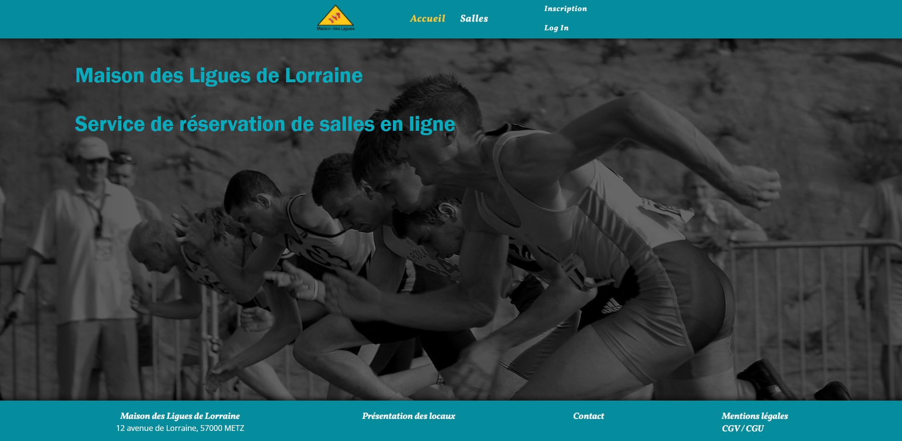
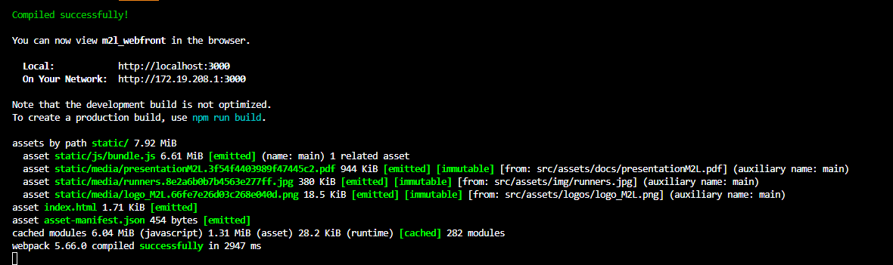

# PPE_M2L_frontend

Pour la Maison des Ligues de Lorraine, nous avons développé une application React.js de réservation de salles de réunion.

## Installation
### Prérequis
Les logiciels ci-dessous sont nécessaires au fonctionnement de notre application web, voici les commandes pour vérifier qu'ils sont bien installés sur votre système. Sinon, télécharger les et suivez les étapes d'installation depuis les liens mis à disposition.

* Git `git --version` ou télécharger et installer [Git](https://git-scm.com/downloads)
* NPM `npm --version` ou télécharger et installer [NPM](https://www.npmjs.com/package/download)
* Node `node --version` ou télécharger et installer [Node.js](https://nodejs.org/en/)

### Installation de l'application

Cloner le repo GitHub et préparer l'app React.js
```
git clone https://github.com/BSevault/PPE_M2L_frontend.git  
cd PPE_M2L_frontend
npm install
```
La commande `npm install` va installer toutes les dépendences liées au projet.

## Lancement
Une fois les étapes de l'intallation effectuée, éxécuter la commande 
`npm run start` depuis le dossier `PPE_M2L_frontend`

Un navigateur web doit normalement se lancer automatiquement.

Page affichée dans le navigateur :


Si le navigateur ne se lance pas, vérifiez dans la console que la compilation a bien été effectué et qu'il n'y a pas de message d'erreur.
Ce qui doit être affiché dans la console :


Ouvrez un navigateur et tapez dans la barre d'addresse du navigateur `http://localhost:3000`
